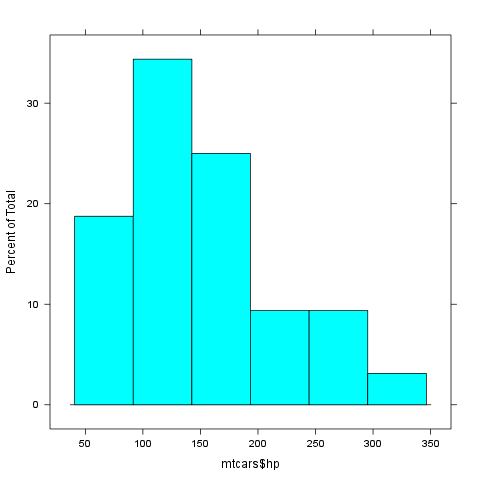

% Gergely Daróczi
% Minimal example for `Pandoc.brew`

# Introduction

We have two meta-information above:

  * author
  * title

A third field could be there too: date. For details, please check out [Pandoc's homepage](http://johnmacfarlane.net/pandoc/README.html#title-block) or just use `pandoc.title` function of this package.

As you can see writing and formatting paragraphs cannot be easier :)

But what about [R](http://www.r-project.org/)? Let us return pi: *3.14159265358979*

# R objects

`Pander.brew` would transform any returned R object to Pandoc's markdown in each code block.

For example `mtcars`'s first 5 cases look like:

-----------------------------------------------------
                  mpg   cyl   disp   hp   drat   wt  
----------------- ----- ----- ------ ---- ------ ----
Mazda RX4         21    6     160    110  3.9    2.6 

Mazda RX4 Wag     21    6     160    110  3.9    2.9 

Datsun 710        23    4     108    93   3.9    2.3 

Hornet 4 Drive    21    6     258    110  3.1    3.2 

Hornet Sportabout 19    8     360    175  3.1    3.4 
-----------------------------------------------------

 
------------------------------------------------
                  qsec   vs   am   gear   carb  
----------------- ------ ---- ---- ------ ------
Mazda RX4         16     0    1    4      4     

Mazda RX4 Wag     17     0    1    4      4     

Datsun 710        19     1    1    4      1     

Hornet 4 Drive    19     1    0    3      1     

Hornet Sportabout 17     0    0    3      2     
------------------------------------------------

As you can see some formatting was added to the returned table and was also split up as the original table would have been too wide.

We could try other R objects too, for example let us check `chisq.test` on some variables of `mtcars`:

-------------------------------
 Test statistic   df   P value 
---------------- ---- ---------
       21         2    2.8e-05 
-------------------------------

Table: Pearson's Chi-squared test: `mtcars$am` and `mtcars$gear`

 `WARNING`^[Chi-squared approximation may be incorrect]

## Returning plot

Plots are automatically grabbed between `brew` tags:

And adding a caption is easy:

# Captions

Just like with tables:

--------------------------------------------
        Murder   Assault   UrbanPop   Rape  
------- -------- --------- ---------- ------
Alabama 13       236       58         21    

Alaska  10       263       48         44    
--------------------------------------------

Table: Here goes the first two lines of USArrests

## It happens

 `ERROR`^[object 'unknown.R.object' not found]

-------
This report was generated with [R](http://www.r-project.org/) (2.15.0) and [pander](https://github.com/daroczig/pander) (0.1) on x86_64-unknown-linux-gnu platform.