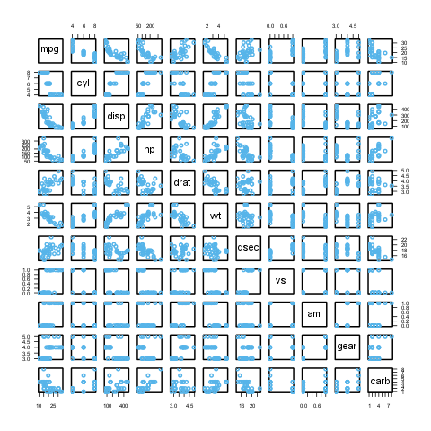

% Gergely Daróczi
% Looong report
% Mon Sep  3 15:00:26 2012

I have written the below report in 10 mins :)

# Dataset

Here I will do a pretty fast report on `mtcars` which is:

--------------------------------------------------------
&nbsp;                    mpg   cyl   disp   hp   drat  
------------------------- ----- ----- ------ ---- ------
**Mazda RX4**             21    6     160    110  3.90  

**Mazda RX4 Wag**         21    6     160    110  3.90  

**Datsun 710**            22.8  4     108    93   3.85  

**Hornet 4 Drive**        21.4  6     258    110  3.08  

**Hornet Sportabout**     18.7  8     360    175  3.15  

**Valiant**               18.1  6     225    105  2.76  

**Duster 360**            14.3  8     360    245  3.21  

**Merc 240D**             24.4  4     146.7  62   3.69  

**Merc 230**              22.8  4     140.8  95   3.92  

**Merc 280**              19.2  6     167.6  123  3.92  

**Merc 280C**             17.8  6     167.6  123  3.92  

**Merc 450SE**            16.4  8     275.8  180  3.07  

**Merc 450SL**            17.3  8     275.8  180  3.07  

**Merc 450SLC**           15.2  8     275.8  180  3.07  

**Cadillac Fleetwood**    10.4  8     472    205  2.93  

**Lincoln Continental**   10.4  8     460    215  3     

**Chrysler Imperial**     14.7  8     440    230  3.23  

**Fiat 128**              32.4  4     78.7   66   4.08  

**Honda Civic**           30.4  4     75.7   52   4.93  

**Toyota Corolla**        33.9  4     71.1   65   4.22  

**Toyota Corona**         21.5  4     120.1  97   3.70  

**Dodge Challenger**      15.5  8     318    150  2.76  

**AMC Javelin**           15.2  8     304    150  3.15  

**Camaro Z28**            13.3  8     350    245  3.73  

**Pontiac Firebird**      19.2  8     400    175  3.08  

**Fiat X1-9**             27.3  4     79     66   4.08  

**Porsche 914-2**         26    4     120.3  91   4.43  

**Lotus Europa**          30.4  4     95.1   113  3.77  

**Ford Pantera L**        15.8  8     351    264  4.22  

**Ferrari Dino**          19.7  6     145    175  3.62  

**Maserati Bora**         15    8     301    335  3.54  

**Volvo 142E**            21.4  4     121    109  4.11  
--------------------------------------------------------

Table: Table continues below

 
-------------------------------------------------------
&nbsp;                    wt    qsec   vs   am   gear  
------------------------- ----- ------ ---- ---- ------
**Mazda RX4**             2.620 16.46  0    1    4     

**Mazda RX4 Wag**         2.875 17.02  0    1    4     

**Datsun 710**            2.320 18.61  1    1    4     

**Hornet 4 Drive**        3.215 19.44  1    0    3     

**Hornet Sportabout**     3.440 17.02  0    0    3     

**Valiant**               3.460 20.22  1    0    3     

**Duster 360**            3.570 15.84  0    0    3     

**Merc 240D**             3.190 20     1    0    4     

**Merc 230**              3.150 22.90  1    0    4     

**Merc 280**              3.440 18.30  1    0    4     

**Merc 280C**             3.440 18.90  1    0    4     

**Merc 450SE**            4.070 17.40  0    0    3     

**Merc 450SL**            3.730 17.60  0    0    3     

**Merc 450SLC**           3.780 18     0    0    3     

**Cadillac Fleetwood**    5.250 17.98  0    0    3     

**Lincoln Continental**   5.424 17.82  0    0    3     

**Chrysler Imperial**     5.345 17.42  0    0    3     

**Fiat 128**              2.200 19.47  1    1    4     

**Honda Civic**           1.615 18.52  1    1    4     

**Toyota Corolla**        1.835 19.90  1    1    4     

**Toyota Corona**         2.465 20.01  1    0    3     

**Dodge Challenger**      3.520 16.87  0    0    3     

**AMC Javelin**           3.435 17.30  0    0    3     

**Camaro Z28**            3.840 15.41  0    0    3     

**Pontiac Firebird**      3.845 17.05  0    0    3     

**Fiat X1-9**             1.935 18.90  1    1    4     

**Porsche 914-2**         2.140 16.70  0    1    5     

**Lotus Europa**          1.513 16.90  1    1    5     

**Ford Pantera L**        3.170 14.50  0    1    5     

**Ferrari Dino**          2.770 15.50  0    1    5     

**Maserati Bora**         3.570 14.60  0    1    5     

**Volvo 142E**            2.780 18.60  1    1    4     
-------------------------------------------------------

Table: Table continues below

 
--------------------------------
&nbsp;                    carb  
------------------------- ------
**Mazda RX4**             4     

**Mazda RX4 Wag**         4     

**Datsun 710**            1     

**Hornet 4 Drive**        1     

**Hornet Sportabout**     2     

**Valiant**               1     

**Duster 360**            4     

**Merc 240D**             2     

**Merc 230**              2     

**Merc 280**              4     

**Merc 280C**             4     

**Merc 450SE**            3     

**Merc 450SL**            3     

**Merc 450SLC**           3     

**Cadillac Fleetwood**    4     

**Lincoln Continental**   4     

**Chrysler Imperial**     4     

**Fiat 128**              1     

**Honda Civic**           2     

**Toyota Corolla**        1     

**Toyota Corona**         1     

**Dodge Challenger**      2     

**AMC Javelin**           2     

**Camaro Z28**            4     

**Pontiac Firebird**      2     

**Fiat X1-9**             1     

**Porsche 914-2**         2     

**Lotus Europa**          2     

**Ford Pantera L**        4     

**Ferrari Dino**          6     

**Maserati Bora**         8     

**Volvo 142E**            2     
--------------------------------

# Descriptives

-------------------------------------------------------------
&nbsp;     Average   Median   Standard.deviation   Variance  
---------- --------- -------- -------------------- ----------
**mpg**    20.0906   19.200   6.0269               3.632e+01 

**cyl**    6.1875    6        1.7859               3.190e+00 

**disp**   230.7219  196.300  123.9387             1.536e+04 

**hp**     146.6875  123      68.5629              4.701e+03 

**drat**   3.5966    3.695    0.5347               2.859e-01 

**wt**     3.2172    3.325    0.9785               9.574e-01 

**qsec**   17.8487   17.710   1.7869               3.193e+00 

**vs**     0.4375    0        0.5040               2.540e-01 

**am**     0.4062    0        0.4990               2.490e-01 

**gear**   3.6875    4        0.7378               5.444e-01 

**carb**   2.8125    2        1.6152               2.609e+00 
-------------------------------------------------------------

## In details

### mpg

We found the folloing values here:

_21_, _21_, _22.8_, _21.4_, _18.7_, _18.1_, _14.3_, _24.4_, _22.8_, _19.2_, _17.8_, _16.4_, _17.3_, _15.2_, _10.4_, _10.4_, _14.7_, _32.4_, _30.4_, _33.9_, _21.5_, _15.5_, _15.2_, _13.3_, _19.2_, _27.3_, _26_, _30.4_, _15.8_, _19.7_, _15_ and _21.4_

The mean of mpg is _20.09_ while the standard deviation is: _6.027_. The most frequent value in mpg is 10.4, but let us check out the frequency table too:

-----------------------------------------------------
10.4   13.3   14.3   14.7   15   15.2   15.5   15.8  
------ ------ ------ ------ ---- ------ ------ ------
2      1      1      1      1    2      1      1     
-----------------------------------------------------

Table: Table continues below

 
-----------------------------------------------------
16.4   17.3   17.8   18.1   18.7   19.2   19.7   21  
------ ------ ------ ------ ------ ------ ------ ----
1      1      1      1      1      2      1      2   
-----------------------------------------------------

Table: Table continues below

 
-----------------------------------------------------
21.4   21.5   22.8   24.4   26   27.3   30.4   32.4  
------ ------ ------ ------ ---- ------ ------ ------
2      1      2      1      1    1      2      1     
-----------------------------------------------------

Table: Table continues below

 
------
33.9  
------
1     
------

Tables are boring, let us show the same with a `histogram`:

### cyl

We found the folloing values here:

_6_, _6_, _4_, _6_, _8_, _6_, _8_, _4_, _4_, _6_, _6_, _8_, _8_, _8_, _8_, _8_, _8_, _4_, _4_, _4_, _4_, _8_, _8_, _8_, _8_, _4_, _4_, _4_, _8_, _6_, _8_ and _4_

The mean of cyl is _6.188_ while the standard deviation is: _1.786_. The most frequent value in cyl is 8, but let us check out the frequency table too:

-----------
4   6   8  
--- --- ---
11  7   14 
-----------

Tables are boring, let us show the same with a `histogram`:

### disp

We found the folloing values here:

_160_, _160_, _108_, _258_, _360_, _225_, _360_, _146.7_, _140.8_, _167.6_, _167.6_, _275.8_, _275.8_, _275.8_, _472_, _460_, _440_, _78.7_, _75.7_, _71.1_, _120.1_, _318_, _304_, _350_, _400_, _79_, _120.3_, _95.1_, _351_, _145_, _301_ and _121_

The mean of disp is _230.7_ while the standard deviation is: _123.9_. The most frequent value in disp is 275.8, but let us check out the frequency table too:

------------------------------------------------------
71.1   75.7   78.7   79   95.1   108   120.1   120.3  
------ ------ ------ ---- ------ ----- ------- -------
1      1      1      1    1      1     1       1      
------------------------------------------------------

Table: Table continues below

 
-----------------------------------------------------
121   140.8   145   146.7   160   167.6   225   258  
----- ------- ----- ------- ----- ------- ----- -----
1     1       1     1       2     2       1     1    
-----------------------------------------------------

Table: Table continues below

 
-------------------------------------------------
275.8   301   304   318   350   351   360   400  
------- ----- ----- ----- ----- ----- ----- -----
3       1     1     1     1     1     2     1    
-------------------------------------------------

Table: Table continues below

 
-----------------
440   460   472  
----- ----- -----
1     1     1    
-----------------

Tables are boring, let us show the same with a `histogram`:

### hp

We found the folloing values here:

_110_, _110_, _93_, _110_, _175_, _105_, _245_, _62_, _95_, _123_, _123_, _180_, _180_, _180_, _205_, _215_, _230_, _66_, _52_, _65_, _97_, _150_, _150_, _245_, _175_, _66_, _91_, _113_, _264_, _175_, _335_ and _109_

The mean of hp is _146.7_ while the standard deviation is: _68.56_. The most frequent value in hp is 110, but let us check out the frequency table too:

---------------------------------------------
52   62   65   66   91   93   95   97   105  
---- ---- ---- ---- ---- ---- ---- ---- -----
1    1    1    2    1    1    1    1    1    
---------------------------------------------

Table: Table continues below

 
-----------------------------------------------
109   110   113   123   150   175   180   205  
----- ----- ----- ----- ----- ----- ----- -----
1     3     1     2     2     3     3     1    
-----------------------------------------------

Table: Table continues below

 
-----------------------------
215   230   245   264   335  
----- ----- ----- ----- -----
1     1     2     1     1    
-----------------------------

Tables are boring, let us show the same with a `histogram`:

### drat

We found the folloing values here:

_3.90_, _3.90_, _3.85_, _3.08_, _3.15_, _2.76_, _3.21_, _3.69_, _3.92_, _3.92_, _3.92_, _3.07_, _3.07_, _3.07_, _2.93_, _3_, _3.23_, _4.08_, _4.93_, _4.22_, _3.70_, _2.76_, _3.15_, _3.73_, _3.08_, _4.08_, _4.43_, _3.77_, _4.22_, _3.62_, _3.54_ and _4.11_

The mean of drat is _3.597_ while the standard deviation is: _0.5347_. The most frequent value in drat is 3.07, but let us check out the frequency table too:

----------------------------------------------------
2.76   2.93   3   3.07   3.08   3.15   3.21   3.23  
------ ------ --- ------ ------ ------ ------ ------
2      1      1   3      2      2      1      1     
----------------------------------------------------

Table: Table continues below

 
-----------------------------------------------------
3.54   3.62   3.69   3.7   3.73   3.77   3.85   3.9  
------ ------ ------ ----- ------ ------ ------ -----
1      1      1      1     1      1      1      2    
-----------------------------------------------------

Table: Table continues below

 
-----------------------------------------
3.92   4.08   4.11   4.22   4.43   4.93  
------ ------ ------ ------ ------ ------
3      2      1      2      1      1     
-----------------------------------------

Tables are boring, let us show the same with a `histogram`:

### wt

We found the folloing values here:

_2.620_, _2.875_, _2.320_, _3.215_, _3.440_, _3.460_, _3.570_, _3.190_, _3.150_, _3.440_, _3.440_, _4.070_, _3.730_, _3.780_, _5.250_, _5.424_, _5.345_, _2.200_, _1.615_, _1.835_, _2.465_, _3.520_, _3.435_, _3.840_, _3.845_, _1.935_, _2.140_, _1.513_, _3.170_, _2.770_, _3.570_ and _2.780_

The mean of wt is _3.217_ while the standard deviation is: _0.9785_. The most frequent value in wt is 3.44, but let us check out the frequency table too:

---------------------------------------------------
1.513   1.615   1.835   1.935   2.14   2.2   2.32  
------- ------- ------- ------- ------ ----- ------
1       1       1       1       1      1     1     
---------------------------------------------------

Table: Table continues below

 
--------------------------------------------------
2.465   2.62   2.77   2.78   2.875   3.15   3.17  
------- ------ ------ ------ ------- ------ ------
1       1      1      1      1       1      1     
--------------------------------------------------

Table: Table continues below

 
--------------------------------------------------
3.19   3.215   3.435   3.44   3.46   3.52   3.57  
------ ------- ------- ------ ------ ------ ------
1      1       1       3      1      1      2     
--------------------------------------------------

Table: Table continues below

 
--------------------------------------------------
3.73   3.78   3.84   3.845   4.07   5.25   5.345  
------ ------ ------ ------- ------ ------ -------
1      1      1      1       1      1      1      
--------------------------------------------------

Table: Table continues below

 
-------
5.424  
-------
1      
-------

Tables are boring, let us show the same with a `histogram`:

### qsec

We found the folloing values here:

_16.46_, _17.02_, _18.61_, _19.44_, _17.02_, _20.22_, _15.84_, _20_, _22.90_, _18.30_, _18.90_, _17.40_, _17.60_, _18_, _17.98_, _17.82_, _17.42_, _19.47_, _18.52_, _19.90_, _20.01_, _16.87_, _17.30_, _15.41_, _17.05_, _18.90_, _16.70_, _16.90_, _14.50_, _15.50_, _14.60_ and _18.60_

The mean of qsec is _17.85_ while the standard deviation is: _1.787_. The most frequent value in qsec is 17.02, but let us check out the frequency table too:

---------------------------------------------------
14.5   14.6   15.41   15.5   15.84   16.46   16.7  
------ ------ ------- ------ ------- ------- ------
1      1      1       1      1       1       1     
---------------------------------------------------

Table: Table continues below

 
----------------------------------------------------
16.87   16.9   17.02   17.05   17.3   17.4   17.42  
------- ------ ------- ------- ------ ------ -------
1       1      2       1       1      1      1      
----------------------------------------------------

Table: Table continues below

 
-------------------------------------------------
17.6   17.82   17.98   18   18.3   18.52   18.6  
------ ------- ------- ---- ------ ------- ------
1      1       1       1    1      1       1     
-------------------------------------------------

Table: Table continues below

 
--------------------------------------------------
18.61   18.9   19.44   19.47   19.9   20   20.01  
------- ------ ------- ------- ------ ---- -------
1       2      1       1       1      1    1      
--------------------------------------------------

Table: Table continues below

 
--------------
20.22   22.9  
------- ------
1       1     
--------------

Tables are boring, let us show the same with a `histogram`:

### vs

We found the folloing values here:

_0_, _0_, _1_, _1_, _0_, _1_, _0_, _1_, _1_, _1_, _1_, _0_, _0_, _0_, _0_, _0_, _0_, _1_, _1_, _1_, _1_, _0_, _0_, _0_, _0_, _1_, _0_, _1_, _0_, _0_, _0_ and _1_

The mean of vs is _0.4375_ while the standard deviation is: _0.504_. The most frequent value in vs is 0, but let us check out the frequency table too:

-------
0   1  
--- ---
18  14 
-------

Tables are boring, let us show the same with a `histogram`:

### am

We found the folloing values here:

_1_, _1_, _1_, _0_, _0_, _0_, _0_, _0_, _0_, _0_, _0_, _0_, _0_, _0_, _0_, _0_, _0_, _1_, _1_, _1_, _0_, _0_, _0_, _0_, _0_, _1_, _1_, _1_, _1_, _1_, _1_ and _1_

The mean of am is _0.4062_ while the standard deviation is: _0.499_. The most frequent value in am is 0, but let us check out the frequency table too:

-------
0   1  
--- ---
19  13 
-------

Tables are boring, let us show the same with a `histogram`:

### gear

We found the folloing values here:

_4_, _4_, _4_, _3_, _3_, _3_, _3_, _4_, _4_, _4_, _4_, _3_, _3_, _3_, _3_, _3_, _3_, _4_, _4_, _4_, _3_, _3_, _3_, _3_, _3_, _4_, _5_, _5_, _5_, _5_, _5_ and _4_

The mean of gear is _3.688_ while the standard deviation is: _0.7378_. The most frequent value in gear is 3, but let us check out the frequency table too:

-----------
3   4   5  
--- --- ---
15  12  5  
-----------

Tables are boring, let us show the same with a `histogram`:

### carb

We found the folloing values here:

_4_, _4_, _1_, _1_, _2_, _1_, _4_, _2_, _2_, _4_, _4_, _3_, _3_, _3_, _4_, _4_, _4_, _1_, _2_, _1_, _1_, _2_, _2_, _4_, _2_, _1_, _2_, _2_, _4_, _6_, _8_ and _2_

The mean of carb is _2.812_ while the standard deviation is: _1.615_. The most frequent value in carb is 2, but let us check out the frequency table too:

-----------------------
1   2   3   4   6   8  
--- --- --- --- --- ---
7   10  3   10  1   1  
-----------------------

Tables are boring, let us show the same with a `histogram`:

# Correlation

And here goes a correlation table:

-------------------------------------------------------
&nbsp;     mpg      cyl      disp     hp       drat    
---------- -------- -------- -------- -------- --------
**mpg**    1        -0.85216 -0.84755 -0.77617 0.68117 

**cyl**    -0.85216 1        0.90203  0.83245  -0.69994

**disp**   -0.84755 0.90203  1        0.79095  -0.71021

**hp**     -0.77617 0.83245  0.79095  1        -0.44876

**drat**   0.68117  -0.69994 -0.71021 -0.44876 1       

**wt**     -0.86766 0.78250  0.88798  0.65875  -0.71244

**qsec**   0.41868  -0.59124 -0.43370 -0.70822 0.09120 

**vs**     0.66404  -0.81081 -0.71042 -0.72310 0.44028 

**am**     0.59983  -0.52261 -0.59123 -0.24320 0.71271 

**gear**   0.48028  -0.49269 -0.55557 -0.12570 0.69961 

**carb**   -0.55093 0.52699  0.39498  0.74981  -0.09079
-------------------------------------------------------

Table: Table continues below

 
-------------------------------------------------------
&nbsp;     wt       qsec     vs       am       gear    
---------- -------- -------- -------- -------- --------
**mpg**    -0.86766 0.41868  0.66404  0.59983  0.48028 

**cyl**    0.78250  -0.59124 -0.81081 -0.52261 -0.49269

**disp**   0.88798  -0.43370 -0.71042 -0.59123 -0.55557

**hp**     0.65875  -0.70822 -0.72310 -0.24320 -0.12570

**drat**   -0.71244 0.09120  0.44028  0.71271  0.69961 

**wt**     1        -0.17472 -0.55492 -0.69250 -0.58329

**qsec**   -0.17472 1        0.74454  -0.22986 -0.21268

**vs**     -0.55492 0.74454  1        0.16835  0.20602 

**am**     -0.69250 -0.22986 0.16835  1        0.79406 

**gear**   -0.58329 -0.21268 0.20602  0.79406  1       

**carb**   0.42761  -0.65625 -0.56961 0.05753  0.27407 
-------------------------------------------------------

Table: Table continues below

 
-------------------
&nbsp;     carb    
---------- --------
**mpg**    -0.55093

**cyl**    0.52699 

**disp**   0.39498 

**hp**     0.74981 

**drat**   -0.09079

**wt**     0.42761 

**qsec**   -0.65625

**vs**     -0.56961

**am**     0.05753 

**gear**   0.27407 

**carb**   1       
-------------------

And the same on a graph:

Yeah, that latter took a while to render in an image file :)

That's not a `pander` issue.

# Some models

Okay, let us find out how `weight` affects other variables:

### mpg

A simple linear model: `mtcars$wt ~ mtcars$mpg`

---------------------------------------------------------------
           &nbsp;  Estimate   Std. Error   t value    Pr(>|t|) 
----------------- ---------- ------------ ---------- ----------
  **(Intercept)** 6.047e+00   3.087e-01   1.959e+01  1.204e-18 

  **Independent** -1.409e-01  1.474e-02   -9.559e+00 1.294e-10 
---------------------------------------------------------------

Table: Fitting linear model: mtcars$wt ~ Independent

### cyl

A simple linear model: `mtcars$wt ~ mtcars$cyl`

--------------------------------------------------------------
           &nbsp;  Estimate   Std. Error   t value   Pr(>|t|) 
----------------- ---------- ------------ --------- ----------
  **(Intercept)** 5.646e-01   4.006e-01   1.409e+00 1.690e-01 

  **Independent** 4.287e-01   6.228e-02   6.883e+00 1.218e-07 
--------------------------------------------------------------

Table: Fitting linear model: mtcars$wt ~ Independent

### disp

A simple linear model: `mtcars$wt ~ mtcars$disp`

--------------------------------------------------------------
           &nbsp;  Estimate   Std. Error   t value   Pr(>|t|) 
----------------- ---------- ------------ --------- ----------
  **(Intercept)** 1.600e+00   1.730e-01   9.248e+00 2.738e-10 

  **Independent** 7.010e-03   6.629e-04   1.058e+01 1.222e-11 
--------------------------------------------------------------

Table: Fitting linear model: mtcars$wt ~ Independent

### hp

A simple linear model: `mtcars$wt ~ mtcars$hp`

--------------------------------------------------------------
           &nbsp;  Estimate   Std. Error   t value   Pr(>|t|) 
----------------- ---------- ------------ --------- ----------
  **(Intercept)** 1.838e+00   3.165e-01   5.808e+00 2.389e-06 

  **Independent** 9.401e-03   1.960e-03   4.796e+00 4.146e-05 
--------------------------------------------------------------

Table: Fitting linear model: mtcars$wt ~ Independent

### drat

A simple linear model: `mtcars$wt ~ mtcars$drat`

---------------------------------------------------------------
           &nbsp;  Estimate   Std. Error   t value    Pr(>|t|) 
----------------- ---------- ------------ ---------- ----------
  **(Intercept)** 7.906e+00   8.522e-01   9.277e+00  2.547e-10 

  **Independent** -1.304e+00  2.345e-01   -5.561e+00 4.784e-06 
---------------------------------------------------------------

Table: Fitting linear model: mtcars$wt ~ Independent

### qsec

A simple linear model: `mtcars$wt ~ mtcars$qsec`

--------------------------------------------------------------
           &nbsp;  Estimate   Std. Error   t value   Pr(>|t|) 
----------------- ---------- ------------ --------- ----------
  **(Intercept)**  4.924792    1.765407   2.789607   0.009081 

  **Independent** -0.095667    0.098433   -0.971907  0.338868 
--------------------------------------------------------------

Table: Fitting linear model: mtcars$wt ~ Independent

### vs

A simple linear model: `mtcars$wt ~ mtcars$vs`

---------------------------------------------------------------
           &nbsp;  Estimate   Std. Error   t value    Pr(>|t|) 
----------------- ---------- ------------ ---------- ----------
  **(Intercept)** 3.689e+00   1.950e-01   1.891e+01  3.203e-18 

  **Independent** -1.077e+00  2.949e-01   -3.654e+00 9.798e-04 
---------------------------------------------------------------

Table: Fitting linear model: mtcars$wt ~ Independent

### am

A simple linear model: `mtcars$wt ~ mtcars$am`

---------------------------------------------------------------
           &nbsp;  Estimate   Std. Error   t value    Pr(>|t|) 
----------------- ---------- ------------ ---------- ----------
  **(Intercept)** 3.769e+00   1.646e-01   2.289e+01  1.490e-20 

  **Independent** -1.358e+00  2.583e-01   -5.258e+00 1.125e-05 
---------------------------------------------------------------

Table: Fitting linear model: mtcars$wt ~ Independent

### gear

A simple linear model: `mtcars$wt ~ mtcars$gear`

---------------------------------------------------------------
           &nbsp;  Estimate   Std. Error   t value    Pr(>|t|) 
----------------- ---------- ------------ ---------- ----------
  **(Intercept)** 6.070e+00   7.392e-01   8.212e+00  3.632e-09 

  **Independent** -7.735e-01  1.967e-01   -3.933e+00 4.587e-04 
---------------------------------------------------------------

Table: Fitting linear model: mtcars$wt ~ Independent

### carb

A simple linear model: `mtcars$wt ~ mtcars$carb`

--------------------------------------------------------------
           &nbsp;  Estimate   Std. Error   t value   Pr(>|t|) 
----------------- ---------- ------------ --------- ----------
  **(Intercept)** 2.489e+00   3.230e-01   7.705e+00 1.353e-08 

  **Independent** 2.590e-01   9.998e-02   2.591e+00 1.464e-02 
--------------------------------------------------------------

Table: Fitting linear model: mtcars$wt ~ Independent

 

-------
This report was generated with [R](http://www.r-project.org/) (2.15.1) and [pander](https://github.com/rapporter/pander) (0.2) in 5.997 sec on x86_64-unknown-linux-gnu platform.