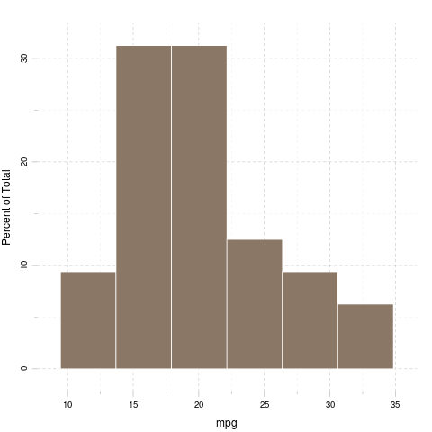
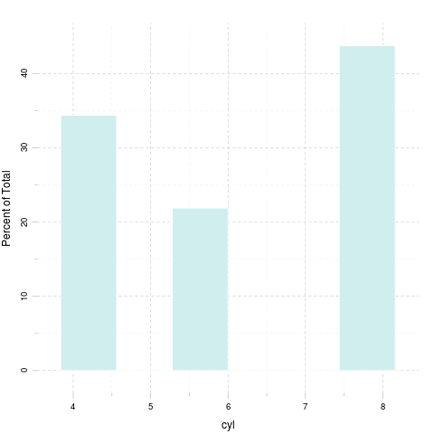
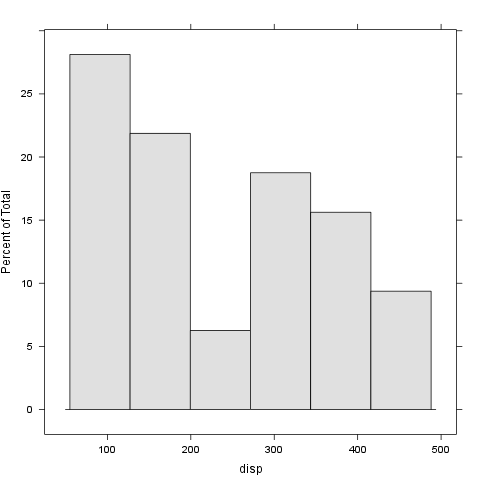
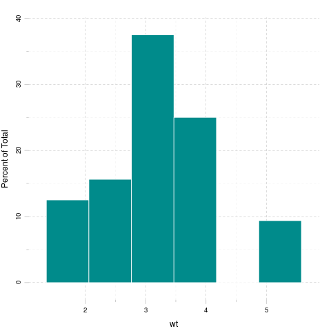
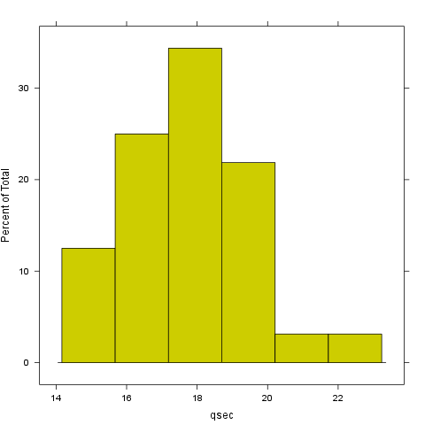
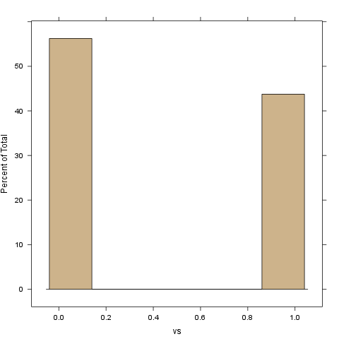
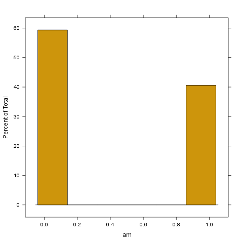
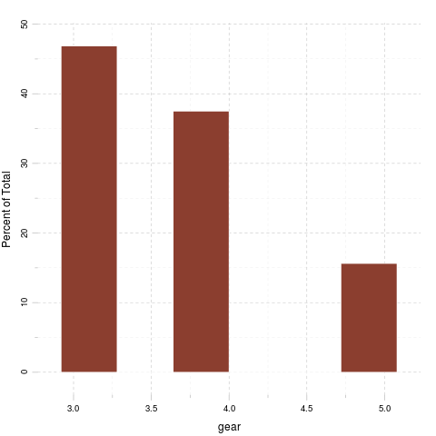
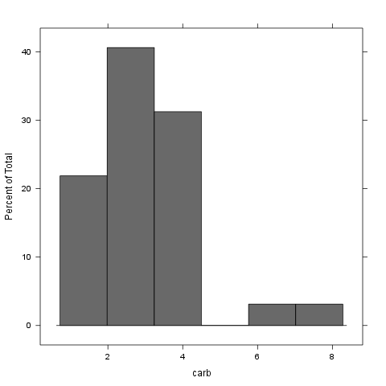

% Gergely Daróczi
% Looong report
% Sat Nov 21 21:54:45 2015

I have written the below report in 10 mins :)

# Dataset

Here I will do a pretty fast report on `mtcars` which is:

-------------------------------------------------------------------------------
         &nbsp;            mpg   cyl   disp   hp   drat   wt    qsec   vs   am 
------------------------- ----- ----- ------ ---- ------ ----- ------ ---- ----
      **Mazda RX4**        21     6    160   110   3.9   2.62  16.46   0    1  

    **Mazda RX4 Wag**      21     6    160   110   3.9   2.875 17.02   0    1  

     **Datsun 710**       22.8    4    108    93   3.85  2.32  18.61   1    1  

   **Hornet 4 Drive**     21.4    6    258   110   3.08  3.215 19.44   1    0  

  **Hornet Sportabout**   18.7    8    360   175   3.15  3.44  17.02   0    0  

       **Valiant**        18.1    6    225   105   2.76  3.46  20.22   1    0  

     **Duster 360**       14.3    8    360   245   3.21  3.57  15.84   0    0  

      **Merc 240D**       24.4    4   146.7   62   3.69  3.19    20    1    0  

      **Merc 230**        22.8    4   140.8   95   3.92  3.15   22.9   1    0  

      **Merc 280**        19.2    6   167.6  123   3.92  3.44   18.3   1    0  

      **Merc 280C**       17.8    6   167.6  123   3.92  3.44   18.9   1    0  

     **Merc 450SE**       16.4    8   275.8  180   3.07  4.07   17.4   0    0  

     **Merc 450SL**       17.3    8   275.8  180   3.07  3.73   17.6   0    0  

     **Merc 450SLC**      15.2    8   275.8  180   3.07  3.78    18    0    0  

 **Cadillac Fleetwood**   10.4    8    472   205   2.93  5.25  17.98   0    0  

 **Lincoln Continental**  10.4    8    460   215    3    5.424 17.82   0    0  

  **Chrysler Imperial**   14.7    8    440   230   3.23  5.345 17.42   0    0  

      **Fiat 128**        32.4    4    78.7   66   4.08   2.2  19.47   1    1  

     **Honda Civic**      30.4    4    75.7   52   4.93  1.615 18.52   1    1  

   **Toyota Corolla**     33.9    4    71.1   65   4.22  1.835  19.9   1    1  

    **Toyota Corona**     21.5    4   120.1   97   3.7   2.465 20.01   1    0  

  **Dodge Challenger**    15.5    8    318   150   2.76  3.52  16.87   0    0  

     **AMC Javelin**      15.2    8    304   150   3.15  3.435  17.3   0    0  

     **Camaro Z28**       13.3    8    350   245   3.73  3.84  15.41   0    0  

  **Pontiac Firebird**    19.2    8    400   175   3.08  3.845 17.05   0    0  

      **Fiat X1-9**       27.3    4     79    66   4.08  1.935  18.9   1    1  

    **Porsche 914-2**      26     4   120.3   91   4.43  2.14   16.7   0    1  

    **Lotus Europa**      30.4    4    95.1  113   3.77  1.513  16.9   1    1  

   **Ford Pantera L**     15.8    8    351   264   4.22  3.17   14.5   0    1  

    **Ferrari Dino**      19.7    6    145   175   3.62  2.77   15.5   0    1  

    **Maserati Bora**      15     8    301   335   3.54  3.57   14.6   0    1  

     **Volvo 142E**       21.4    4    121   109   4.11  2.78   18.6   1    1  
-------------------------------------------------------------------------------

Table: Table continues below

 
---------------------------------------
         &nbsp;            gear   carb 
------------------------- ------ ------
      **Mazda RX4**         4      4   

    **Mazda RX4 Wag**       4      4   

     **Datsun 710**         4      1   

   **Hornet 4 Drive**       3      1   

  **Hornet Sportabout**     3      2   

       **Valiant**          3      1   

     **Duster 360**         3      4   

      **Merc 240D**         4      2   

      **Merc 230**          4      2   

      **Merc 280**          4      4   

      **Merc 280C**         4      4   

     **Merc 450SE**         3      3   

     **Merc 450SL**         3      3   

     **Merc 450SLC**        3      3   

 **Cadillac Fleetwood**     3      4   

 **Lincoln Continental**    3      4   

  **Chrysler Imperial**     3      4   

      **Fiat 128**          4      1   

     **Honda Civic**        4      2   

   **Toyota Corolla**       4      1   

    **Toyota Corona**       3      1   

  **Dodge Challenger**      3      2   

     **AMC Javelin**        3      2   

     **Camaro Z28**         3      4   

  **Pontiac Firebird**      3      2   

      **Fiat X1-9**         4      1   

    **Porsche 914-2**       5      2   

    **Lotus Europa**        5      2   

   **Ford Pantera L**       5      4   

    **Ferrari Dino**        5      6   

    **Maserati Bora**       5      8   

     **Volvo 142E**         4      2   
---------------------------------------

# Descriptives

-------------------------------------------------------------
  &nbsp;    Average   Median   Standard.deviation   Variance 
---------- --------- -------- -------------------- ----------
 **mpg**     20.09     19.2          6.027           36.32   

 **cyl**     6.188      6            1.786            3.19   

 **disp**    230.7    196.3          123.9           15361   

  **hp**     146.7     123           68.56            4701   

 **drat**    3.597    3.695          0.5347          0.2859  

  **wt**     3.217    3.325          0.9785          0.9574  

 **qsec**    17.85    17.71          1.787           3.193   

  **vs**    0.4375      0            0.504           0.254   

  **am**    0.4062      0            0.499           0.249   

 **gear**    3.688      4            0.7378          0.5444  

 **carb**    2.812      2            1.615           2.609   
-------------------------------------------------------------

## In details

### mpg

We found the folloing values here:

_21_, _21_, _22.8_, _21.4_, _18.7_, _18.1_, _14.3_, _24.4_, _22.8_, _19.2_, _17.8_, _16.4_, _17.3_, _15.2_, _10.4_, _10.4_, _14.7_, _32.4_, _30.4_, _33.9_, _21.5_, _15.5_, _15.2_, _13.3_, _19.2_, _27.3_, _26_, _30.4_, _15.8_, _19.7_, _15_ and _21.4_

The mean of mpg is _20.09_ while the standard deviation is: _6.027_. The most frequent value in mpg is 10.4, but let us check out the frequency table too:

--------------------------------------------------------------------------
 10.4   13.3   14.3   14.7   15   15.2   15.5   15.8   16.4   17.3   17.8 
------ ------ ------ ------ ---- ------ ------ ------ ------ ------ ------
  2      1      1      1     1     2      1      1      1      1      1   
--------------------------------------------------------------------------

Table: Table continues below

 
-------------------------------------------------------------------------------
 18.1   18.7   19.2   19.7   21   21.4   21.5   22.8   24.4   26   27.3   30.4 
------ ------ ------ ------ ---- ------ ------ ------ ------ ---- ------ ------
  1      1      2      1     2     2      1      2      1     1     1      2   
-------------------------------------------------------------------------------

Table: Table continues below

 
-------------
 32.4   33.9 
------ ------
  1      1   
-------------

Tables are boring, let us show the same with a `histogram`:

### cyl

We found the folloing values here:

_6_, _6_, _4_, _6_, _8_, _6_, _8_, _4_, _4_, _6_, _6_, _8_, _8_, _8_, _8_, _8_, _8_, _4_, _4_, _4_, _4_, _8_, _8_, _8_, _8_, _4_, _4_, _4_, _8_, _6_, _8_ and _4_

The mean of cyl is _6.188_ while the standard deviation is: _1.786_. The most frequent value in cyl is 8, but let us check out the frequency table too:

-----------
 4   6   8 
--- --- ---
11   7  14 
-----------

Tables are boring, let us show the same with a `histogram`:

### disp

We found the folloing values here:

_160_, _160_, _108_, _258_, _360_, _225_, _360_, _146.7_, _140.8_, _167.6_, _167.6_, _275.8_, _275.8_, _275.8_, _472_, _460_, _440_, _78.7_, _75.7_, _71.1_, _120.1_, _318_, _304_, _350_, _400_, _79_, _120.3_, _95.1_, _351_, _145_, _301_ and _121_

The mean of disp is _230.7_ while the standard deviation is: _123.9_. The most frequent value in disp is 275.8, but let us check out the frequency table too:

--------------------------------------------------------------------------
 71.1   75.7   78.7   79   95.1   108   120.1   120.3   121   140.8   145 
------ ------ ------ ---- ------ ----- ------- ------- ----- ------- -----
  1      1      1     1     1      1      1       1      1      1      1  
--------------------------------------------------------------------------

Table: Table continues below

 
-----------------------------------------------------------------------------
 146.7   160   167.6   225   258   275.8   301   304   318   350   351   360 
------- ----- ------- ----- ----- ------- ----- ----- ----- ----- ----- -----
   1      2      2      1     1      3      1     1     1     1     1     2  
-----------------------------------------------------------------------------

Table: Table continues below

 
-----------------------
 400   440   460   472 
----- ----- ----- -----
  1     1     1     1  
-----------------------

Tables are boring, let us show the same with a `histogram`:

### hp

We found the folloing values here:

_110_, _110_, _93_, _110_, _175_, _105_, _245_, _62_, _95_, _123_, _123_, _180_, _180_, _180_, _205_, _215_, _230_, _66_, _52_, _65_, _97_, _150_, _150_, _245_, _175_, _66_, _91_, _113_, _264_, _175_, _335_ and _109_

The mean of hp is _146.7_ while the standard deviation is: _68.56_. The most frequent value in hp is 110, but let us check out the frequency table too:

---------------------------------------------------------------------------
 52   62   65   66   91   93   95   97   105   109   110   113   123   150 
---- ---- ---- ---- ---- ---- ---- ---- ----- ----- ----- ----- ----- -----
 1    1    1    2    1    1    1    1     1     1     3     1     2     2  
---------------------------------------------------------------------------

Table: Table continues below

 
-----------------------------------------------
 175   180   205   215   230   245   264   335 
----- ----- ----- ----- ----- ----- ----- -----
  3     3     1     1     1     2     1     1  
-----------------------------------------------

Tables are boring, let us show the same with a `histogram`:

### drat

We found the folloing values here:

_3.9_, _3.9_, _3.85_, _3.08_, _3.15_, _2.76_, _3.21_, _3.69_, _3.92_, _3.92_, _3.92_, _3.07_, _3.07_, _3.07_, _2.93_, _3_, _3.23_, _4.08_, _4.93_, _4.22_, _3.7_, _2.76_, _3.15_, _3.73_, _3.08_, _4.08_, _4.43_, _3.77_, _4.22_, _3.62_, _3.54_ and _4.11_

The mean of drat is _3.597_ while the standard deviation is: _0.5347_. The most frequent value in drat is 3.07, but let us check out the frequency table too:

-------------------------------------------------------------------------------
 2.76   2.93   3   3.07   3.08   3.15   3.21   3.23   3.54   3.62   3.69   3.7 
------ ------ --- ------ ------ ------ ------ ------ ------ ------ ------ -----
  2      1     1    3      2      2      1      1      1      1      1      1  
-------------------------------------------------------------------------------

Table: Table continues below

 
--------------------------------------------------------------------
 3.73   3.77   3.85   3.9   3.92   4.08   4.11   4.22   4.43   4.93 
------ ------ ------ ----- ------ ------ ------ ------ ------ ------
  1      1      1      2     3      2      1      2      1      1   
--------------------------------------------------------------------

Tables are boring, let us show the same with a `histogram`:

### wt

We found the folloing values here:

_2.62_, _2.875_, _2.32_, _3.215_, _3.44_, _3.46_, _3.57_, _3.19_, _3.15_, _3.44_, _3.44_, _4.07_, _3.73_, _3.78_, _5.25_, _5.424_, _5.345_, _2.2_, _1.615_, _1.835_, _2.465_, _3.52_, _3.435_, _3.84_, _3.845_, _1.935_, _2.14_, _1.513_, _3.17_, _2.77_, _3.57_ and _2.78_

The mean of wt is _3.217_ while the standard deviation is: _0.9785_. The most frequent value in wt is 3.44, but let us check out the frequency table too:

--------------------------------------------------------------------------------
 1.513   1.615   1.835   1.935   2.14   2.2   2.32   2.465   2.62   2.77   2.78 
------- ------- ------- ------- ------ ----- ------ ------- ------ ------ ------
   1       1       1       1      1      1     1       1      1      1      1   
--------------------------------------------------------------------------------

Table: Table continues below

 
-------------------------------------------------------------------------------
 2.875   3.15   3.17   3.19   3.215   3.435   3.44   3.46   3.52   3.57   3.73 
------- ------ ------ ------ ------- ------- ------ ------ ------ ------ ------
   1      1      1      1       1       1      3      1      1      2      1   
-------------------------------------------------------------------------------

Table: Table continues below

 
---------------------------------------------------
 3.78   3.84   3.845   4.07   5.25   5.345   5.424 
------ ------ ------- ------ ------ ------- -------
  1      1       1      1      1       1       1   
---------------------------------------------------

Tables are boring, let us show the same with a `histogram`:

### qsec

We found the folloing values here:

_16.46_, _17.02_, _18.61_, _19.44_, _17.02_, _20.22_, _15.84_, _20_, _22.9_, _18.3_, _18.9_, _17.4_, _17.6_, _18_, _17.98_, _17.82_, _17.42_, _19.47_, _18.52_, _19.9_, _20.01_, _16.87_, _17.3_, _15.41_, _17.05_, _18.9_, _16.7_, _16.9_, _14.5_, _15.5_, _14.6_ and _18.6_

The mean of qsec is _17.85_ while the standard deviation is: _1.787_. The most frequent value in qsec is 17.02, but let us check out the frequency table too:

--------------------------------------------------------------------------
 14.5   14.6   15.41   15.5   15.84   16.46   16.7   16.87   16.9   17.02 
------ ------ ------- ------ ------- ------- ------ ------- ------ -------
  1      1       1      1       1       1      1       1      1       2   
--------------------------------------------------------------------------

Table: Table continues below

 
-------------------------------------------------------------------------------
 17.05   17.3   17.4   17.42   17.6   17.82   17.98   18   18.3   18.52   18.6 
------- ------ ------ ------- ------ ------- ------- ---- ------ ------- ------
   1      1      1       1      1       1       1     1     1       1      1   
-------------------------------------------------------------------------------

Table: Table continues below

 
-----------------------------------------------------------------
 18.61   18.9   19.44   19.47   19.9   20   20.01   20.22   22.9 
------- ------ ------- ------- ------ ---- ------- ------- ------
   1      2       1       1      1     1      1       1      1   
-----------------------------------------------------------------

Tables are boring, let us show the same with a `histogram`:

### vs

We found the folloing values here:

_0_, _0_, _1_, _1_, _0_, _1_, _0_, _1_, _1_, _1_, _1_, _0_, _0_, _0_, _0_, _0_, _0_, _1_, _1_, _1_, _1_, _0_, _0_, _0_, _0_, _1_, _0_, _1_, _0_, _0_, _0_ and _1_

The mean of vs is _0.4375_ while the standard deviation is: _0.504_. The most frequent value in vs is 0, but let us check out the frequency table too:

-------
 0   1 
--- ---
18  14 
-------

Tables are boring, let us show the same with a `histogram`:

### am

We found the folloing values here:

_1_, _1_, _1_, _0_, _0_, _0_, _0_, _0_, _0_, _0_, _0_, _0_, _0_, _0_, _0_, _0_, _0_, _1_, _1_, _1_, _0_, _0_, _0_, _0_, _0_, _1_, _1_, _1_, _1_, _1_, _1_ and _1_

The mean of am is _0.4062_ while the standard deviation is: _0.499_. The most frequent value in am is 0, but let us check out the frequency table too:

-------
 0   1 
--- ---
19  13 
-------

Tables are boring, let us show the same with a `histogram`:

### gear

We found the folloing values here:

_4_, _4_, _4_, _3_, _3_, _3_, _3_, _4_, _4_, _4_, _4_, _3_, _3_, _3_, _3_, _3_, _3_, _4_, _4_, _4_, _3_, _3_, _3_, _3_, _3_, _4_, _5_, _5_, _5_, _5_, _5_ and _4_

The mean of gear is _3.688_ while the standard deviation is: _0.7378_. The most frequent value in gear is 3, but let us check out the frequency table too:

-----------
 3   4   5 
--- --- ---
15  12   5 
-----------

Tables are boring, let us show the same with a `histogram`:

### carb

We found the folloing values here:

_4_, _4_, _1_, _1_, _2_, _1_, _4_, _2_, _2_, _4_, _4_, _3_, _3_, _3_, _4_, _4_, _4_, _1_, _2_, _1_, _1_, _2_, _2_, _4_, _2_, _1_, _2_, _2_, _4_, _6_, _8_ and _2_

The mean of carb is _2.812_ while the standard deviation is: _1.615_. The most frequent value in carb is 2, but let us check out the frequency table too:

-----------------------
 1   2   3   4   6   8 
--- --- --- --- --- ---
 7  10   3  10   1   1 
-----------------------

Tables are boring, let us show the same with a `histogram`:

# Correlation

And here goes a correlation table:

---------------------------------------------------------------------------
  &nbsp;     mpg     cyl    disp     hp      drat     wt     qsec     vs   
---------- ------- ------- ------- ------- -------- ------- ------- -------
 **mpg**      1    -0.8522 -0.8476 -0.7762  0.6812  -0.8677 0.4187   0.664 

 **cyl**   -0.8522    1     0.902  0.8324  -0.6999  0.7825  -0.5912 -0.8108

 **disp**  -0.8476  0.902     1    0.7909  -0.7102   0.888  -0.4337 -0.7104

  **hp**   -0.7762 0.8324  0.7909     1    -0.4488  0.6587  -0.7082 -0.7231

 **drat**  0.6812  -0.6999 -0.7102 -0.4488    1     -0.7124 0.0912  0.4403 

  **wt**   -0.8677 0.7825   0.888  0.6587  -0.7124     1    -0.1747 -0.5549

 **qsec**  0.4187  -0.5912 -0.4337 -0.7082  0.0912  -0.1747    1    0.7445 

  **vs**    0.664  -0.8108 -0.7104 -0.7231  0.4403  -0.5549 0.7445     1   

  **am**   0.5998  -0.5226 -0.5912 -0.2432  0.7127  -0.6925 -0.2299 0.1683 

 **gear**  0.4803  -0.4927 -0.5556 -0.1257  0.6996  -0.5833 -0.2127  0.206 

 **carb**  -0.5509  0.527   0.395  0.7498  -0.09079 0.4276  -0.6562 -0.5696
---------------------------------------------------------------------------

Table: Table continues below

 
-----------------------------------
  &nbsp;     am     gear     carb  
---------- ------- ------- --------
 **mpg**   0.5998  0.4803  -0.5509 

 **cyl**   -0.5226 -0.4927  0.527  

 **disp**  -0.5912 -0.5556  0.395  

  **hp**   -0.2432 -0.1257  0.7498 

 **drat**  0.7127  0.6996  -0.09079

  **wt**   -0.6925 -0.5833  0.4276 

 **qsec**  -0.2299 -0.2127 -0.6562 

  **vs**   0.1683   0.206  -0.5696 

  **am**      1    0.7941  0.05753 

 **gear**  0.7941     1     0.2741 

 **carb**  0.05753 0.2741     1    
-----------------------------------

And the same on a graph:

Yeah, that latter took a while to render in an image file :)

That's not a `pander` issue.

# Some models

Okay, let us find out how `weight` affects other variables:

### mpg

A simple linear model: `mtcars$wt ~ mtcars$mpg`

--------------------------------------------------------------
     &nbsp;        Estimate   Std. Error   t value   Pr(>|t|) 
----------------- ---------- ------------ --------- ----------
 **Independent**   -0.1409     0.01474     -9.559   1.294e-10 

 **(Intercept)**    6.047       0.3087      19.59   1.204e-18 
--------------------------------------------------------------

Table: Fitting linear model: mtcars$wt ~ Independent

### cyl

A simple linear model: `mtcars$wt ~ mtcars$cyl`

--------------------------------------------------------------
     &nbsp;        Estimate   Std. Error   t value   Pr(>|t|) 
----------------- ---------- ------------ --------- ----------
 **Independent**    0.4287     0.06228      6.883   1.218e-07 

 **(Intercept)**    0.5646      0.4006      1.409     0.169   
--------------------------------------------------------------

Table: Fitting linear model: mtcars$wt ~ Independent

### disp

A simple linear model: `mtcars$wt ~ mtcars$disp`

--------------------------------------------------------------
     &nbsp;        Estimate   Std. Error   t value   Pr(>|t|) 
----------------- ---------- ------------ --------- ----------
 **Independent**   0.00701    0.0006629     10.58   1.222e-11 

 **(Intercept)**     1.6        0.173       9.248   2.738e-10 
--------------------------------------------------------------

Table: Fitting linear model: mtcars$wt ~ Independent

### hp

A simple linear model: `mtcars$wt ~ mtcars$hp`

--------------------------------------------------------------
     &nbsp;        Estimate   Std. Error   t value   Pr(>|t|) 
----------------- ---------- ------------ --------- ----------
 **Independent**   0.009401    0.00196      4.796   4.146e-05 

 **(Intercept)**    1.838       0.3165      5.808   2.389e-06 
--------------------------------------------------------------

Table: Fitting linear model: mtcars$wt ~ Independent

### drat

A simple linear model: `mtcars$wt ~ mtcars$drat`

--------------------------------------------------------------
     &nbsp;        Estimate   Std. Error   t value   Pr(>|t|) 
----------------- ---------- ------------ --------- ----------
 **Independent**    -1.304      0.2345     -5.561   4.784e-06 

 **(Intercept)**    7.906       0.8522      9.277   2.547e-10 
--------------------------------------------------------------

Table: Fitting linear model: mtcars$wt ~ Independent

### qsec

A simple linear model: `mtcars$wt ~ mtcars$qsec`

--------------------------------------------------------------
     &nbsp;        Estimate   Std. Error   t value   Pr(>|t|) 
----------------- ---------- ------------ --------- ----------
 **Independent**   -0.09567    0.09843     -0.9719    0.3389  

 **(Intercept)**    4.925       1.765       2.79     0.009081 
--------------------------------------------------------------

Table: Fitting linear model: mtcars$wt ~ Independent

### vs

A simple linear model: `mtcars$wt ~ mtcars$vs`

--------------------------------------------------------------
     &nbsp;        Estimate   Std. Error   t value   Pr(>|t|) 
----------------- ---------- ------------ --------- ----------
 **Independent**    -1.077      0.2949     -3.654   0.0009798 

 **(Intercept)**    3.689       0.195       18.91   3.203e-18 
--------------------------------------------------------------

Table: Fitting linear model: mtcars$wt ~ Independent

### am

A simple linear model: `mtcars$wt ~ mtcars$am`

--------------------------------------------------------------
     &nbsp;        Estimate   Std. Error   t value   Pr(>|t|) 
----------------- ---------- ------------ --------- ----------
 **Independent**    -1.358      0.2583     -5.258   1.125e-05 

 **(Intercept)**    3.769       0.1646      22.89    1.49e-20 
--------------------------------------------------------------

Table: Fitting linear model: mtcars$wt ~ Independent

### gear

A simple linear model: `mtcars$wt ~ mtcars$gear`

--------------------------------------------------------------
     &nbsp;        Estimate   Std. Error   t value   Pr(>|t|) 
----------------- ---------- ------------ --------- ----------
 **Independent**   -0.7735      0.1967     -3.933   0.0004587 

 **(Intercept)**     6.07       0.7392      8.212   3.632e-09 
--------------------------------------------------------------

Table: Fitting linear model: mtcars$wt ~ Independent

### carb

A simple linear model: `mtcars$wt ~ mtcars$carb`

--------------------------------------------------------------
     &nbsp;        Estimate   Std. Error   t value   Pr(>|t|) 
----------------- ---------- ------------ --------- ----------
 **Independent**    0.259      0.09998      2.591    0.01464  

 **(Intercept)**    2.489       0.323       7.705   1.353e-08 
--------------------------------------------------------------

Table: Fitting linear model: mtcars$wt ~ Independent

 
